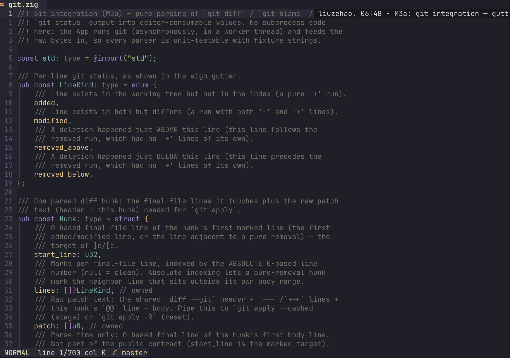
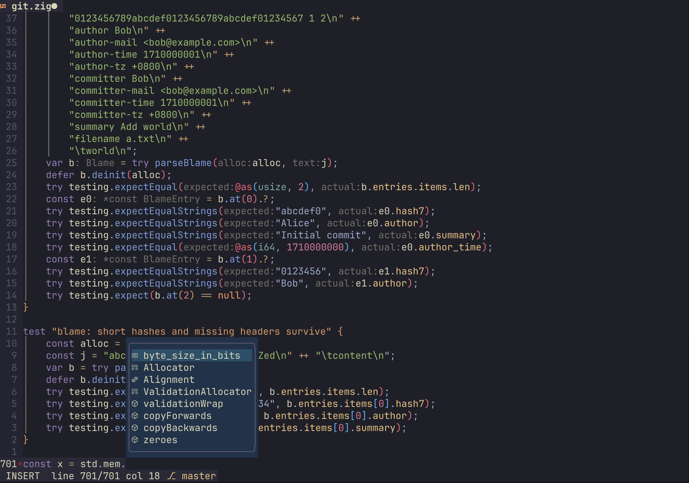
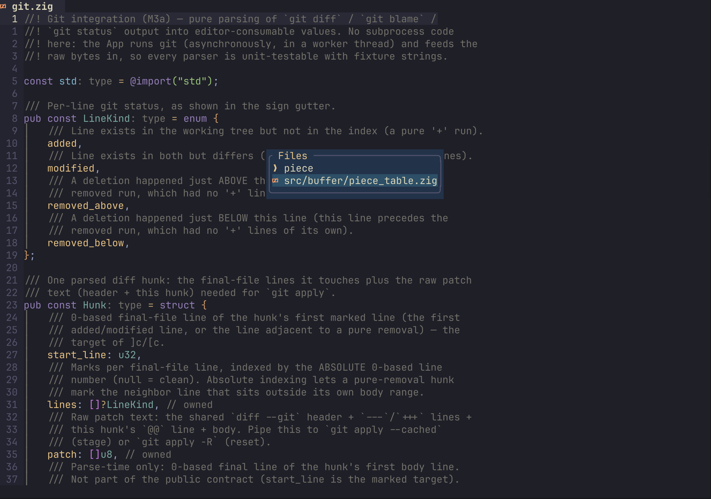
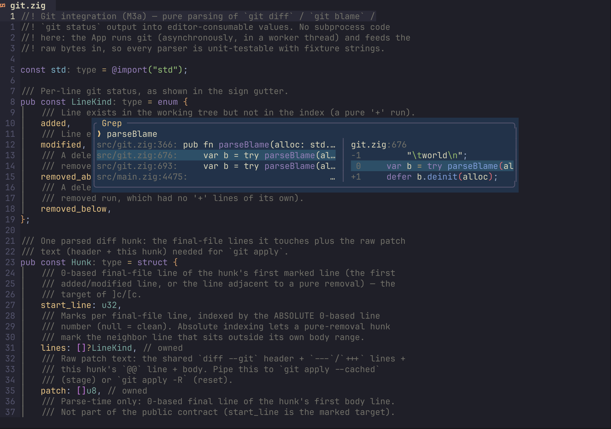
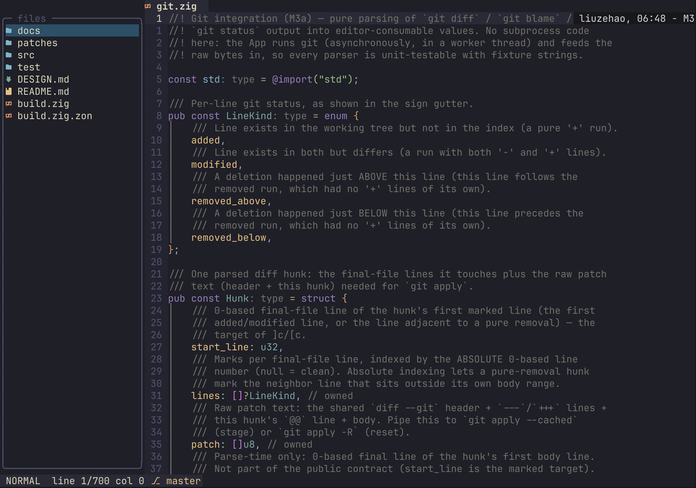
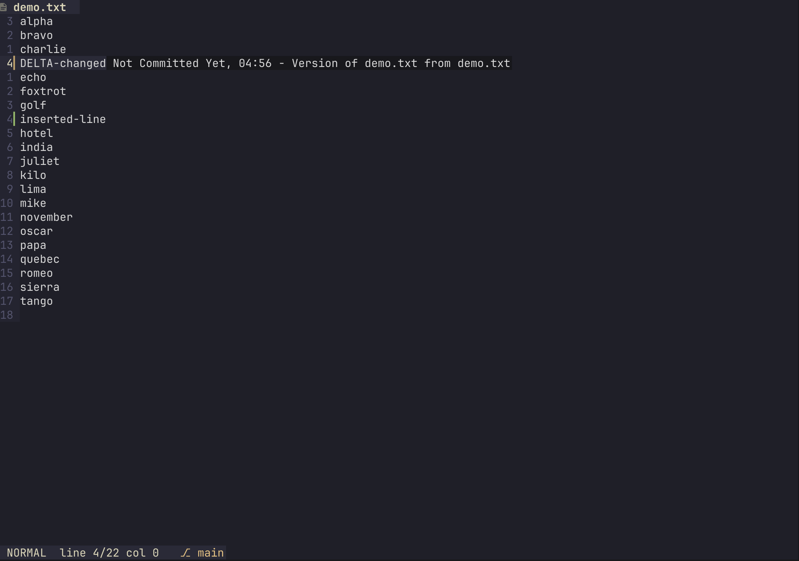
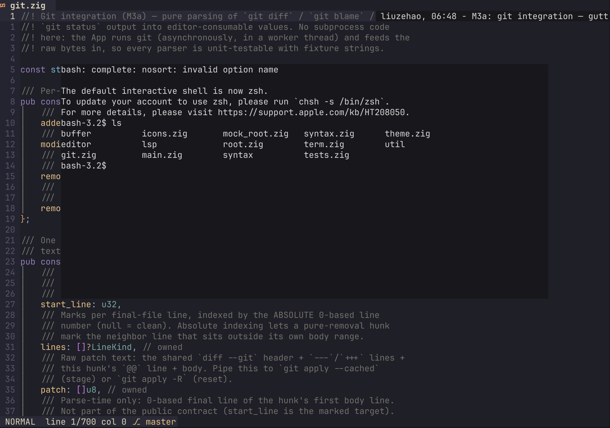

# oz

English | [中文](README.zh-CN.md)

A terminal text editor written in Zig.

## Features

**Editing (vim-style)**

- Six modes: Normal / Insert / Visual / Visual Line / Visual Block / Command
- Full motions with counts: hjkl, w/e/b/ge, ^/0/$, gg/G, {/}, %, f/F/t/T, Ctrl-u/d/f/b
- Text objects, surround, comments, alignment, EasyMotion (s / `<leader>f`), multi-cursor (Ctrl+n)
- Undo/redo (grouped + branch semantics), register semantics (linewise/charwise yank & put)
- Splits (:sp/:vs + Ctrl-w family), buffer tab bar, relative line numbers, code folding

**Syntax & UI**

- tree-sitter syntax highlighting (multiple bundled grammars), rainbow brackets, indent guides + scope highlight animation
- Multiple themes (`<leader>sp` theme picker with live preview; the choice persists automatically — no config or env var needed)
- Large-file degradation: highlighting turns off above 100 KB to stay smooth



**LSP**

- Async attach (never blocks startup); works with zls and other common servers (auto-detects mason install paths)
- Hover (K), goto definition/declaration/references/implementation (gd/gD/gr/gI), signature help (gs)
- Diagnostics gutter marks + `]d`/`[d` jumps + diagnostics list (`<leader>sd`)
- Auto-completion menu + ghost text (`<C-n>`/trigger characters), inlay hints (`<leader>ti`)
- Rename (`<leader>rn`), format (`<leader>lf`), document outline (`<leader>o`)



**Navigation & search**

- Fuzzy pickers: files (`<leader>sf`), grep (`<leader>st`), buffers (`<leader>sb`), recent files (`<leader>sr`), keymaps (`<leader>sk`)
- File tree (`<leader>e` toggle, `<leader>E` locate current file)
- In-buffer search (`/`, `?`, n/N)







**Git**

- Gutter diff marks, `]c`/`[c` hunk jumps, `<leader>hs`/`<leader>hr` stage/reset, `<leader>hp` hunk preview
- Current-line blame ghost text (shows 1s after the cursor settles, `<leader>tb` toggles), `<leader>lg` floating lazygit
- Branch name in the status bar



**Terminal**

- Embedded terminal (Linux / macOS): `Alt+r` floating / `Alt+w` bottom / `Alt+e` right; Esc in the terminal returns to Normal mode



## Build & run

Requires Zig 0.16.0:

```sh
zig build                                    # dev build
zig build -Doptimize=ReleaseFast -Dstrip     # release build (daily driver)
zig build test                               # unit tests
zig build e2e                                # pty end-to-end tests (Linux only for now)
```

Run: `oz [file[:line]]`

## Performance

Methodology: pty-driven with screen reconstruction, same machine (Apple Silicon, macOS), same files, median of 3 runs.

| Scenario | oz | nvim --clean |
|---|---|---|
| Startup (small file) | 66 ms | 115 ms |
| Startup (5 MB / 100k lines) | 65 ms | 118 ms |
| Startup (.zig, zls installed) | 52 ms | 117 ms |
| G to end of file (100k lines) | 54 ms | 65 ms |
| 100× Ctrl-F paging | 54 ms | 100 ms |
| 500× j cursor moves | 53 ms | 100 ms |
| Type 100 chars | 64 ms | 66 ms |
| Type 30 chars at EOF of a 100k-line file | 71 ms | 56 ms |
| Full-text search (100k lines) | 58 ms | 66 ms |
| Type 60 chars with LSP attached | 60 ms | 56 ms |

On par with or faster than nvim in every scenario. Key design choices: mmap-backed lazy file loading, PieceTable with incremental line index, incremental tree-sitter parsing, async LSP handshake + writer thread + incremental sync, atomic saves (temp file + rename).
